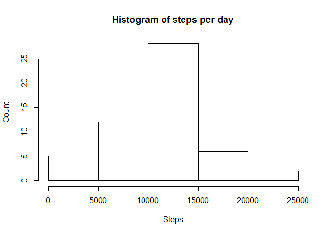
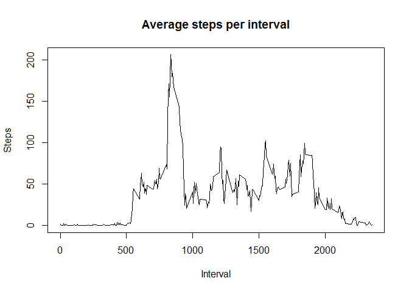
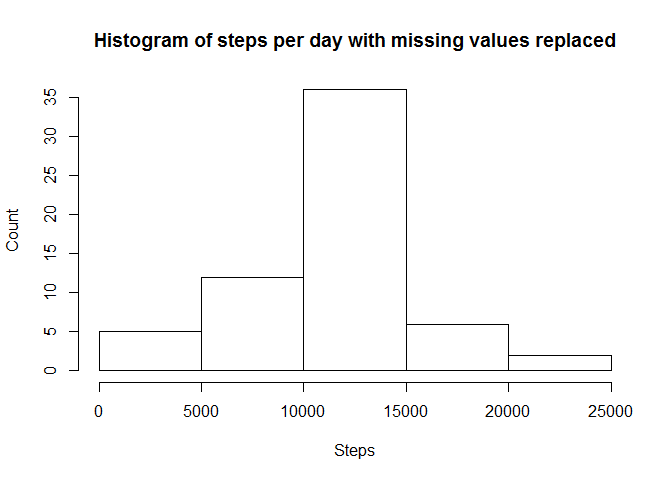
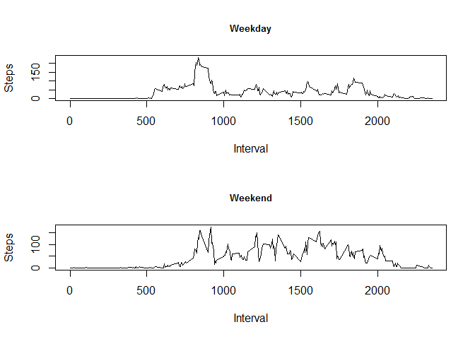

# Reproducible Research: Peer Assessment 1


## Loading and preprocessing the data
  
###--1--
  
Loading the relevant pacakges...  


```r
library(dplyr)
```

```
## 
## Attaching package: 'dplyr'
## 
## The following objects are masked from 'package:stats':
## 
##     filter, lag
## 
## The following objects are masked from 'package:base':
## 
##     intersect, setdiff, setequal, union
```

```r
library(ggplot2)
library(lubridate)
```

Setting the working directory to where the data has been downloaded to     
(this should also be the directory that you clone to GitHub if you are doing that)  


```r
setwd("C:/Users/twilson/Desktop/R/R_Crse/5rr/cp1/RepData_PeerAssessment1")
```

Loading the data in a format that can be used by dplyr (a very helpful data manipulation package)  


```r
data <- tbl_df(read.csv("activity.csv"))
```
  
###--2--  

Processing the data so it is suitable for analysis
  

```r
data <- mutate(data, date = ymd(date))
```
  
## What is mean total number of steps taken per day?

###--1--

Code to calculate the total number of steps taken per day


```r
data_1 <- group_by(data, date)
data_1 <- tbl_df(summarise(data_1, sum(steps)))
colnames(data_1)[2] <- "steps"
data_1
```

```
## Source: local data frame [61 x 2]
## 
##          date steps
## 1  2012-10-01    NA
## 2  2012-10-02   126
## 3  2012-10-03 11352
## 4  2012-10-04 12116
## 5  2012-10-05 13294
## 6  2012-10-06 15420
## 7  2012-10-07 11015
## 8  2012-10-08    NA
## 9  2012-10-09 12811
## 10 2012-10-10  9900
## ..        ...   ...
```

###--2--
  
Code to create histogram:  
     

```r
hist(data_1$steps, xlab = "Steps", main = "Histogram of steps per day", ylab = "Count")
```

 

###--3--
  
Using the following code, we can calculate that...
  

```r
meanday <- mean(data_1$steps, na.rm = TRUE)
medianday <- median(data_1$steps, na.rm = TRUE)
```


The mean of steps per day is: 

```r
meanday
```

```
## [1] 10766.19
```

And the median of steps per day is: 

```r
medianday 
```

```
## [1] 10765
```
  
  
## What is the average daily activity pattern?

###--1--
  
This code prepares the data to calculate the answer to this question:    

```r
data_2 <- group_by(data, interval) #arranging the data by interval
data_2 <- summarise(data_2, mean(steps, na.rm=TRUE)) #averaging for each interval
colnames(data_2)[2] <- "Average_Steps" #renaming the column of the new dataframe
```

This code generates the graph:  
  

```r
plot(data_2$interval, data_2$Average_Steps, type = "l",
     main="Average steps per interval",
     xlab="Interval",
     ylab="Steps")
```

 

###--2--
   
This code prepares the data to identify the interval with the highest number of steps taken:  
  

```r
data_2_s <- data_2[order(-data_2$Average_Steps, na.last=TRUE),]
```
  
The interval with the highest average steps is:

```r
data_2_s[1,1]
```

```
## Source: local data frame [1 x 1]
## 
##   interval
## 1      835
```
  
  
  
## Imputing missing values
  
###--1--
  
There are many missing values in this dataset.  
  
In particular, there are the following number of missing values:  
  

```r
sum(is.na(data$steps))
```

```
## [1] 2304
```

###--2--
  
Using the data calculated in the previous question, we can replace those missing values with the average value for that interval calculated using observations from other days when the data was not missing.
  
###--3--

The following code implements the strategy described in the previous section.
  

```r
data_flld <- data
for (i in seq_len(nrow(data_flld))) { 
        if (is.na(data_flld$steps[i]) == "TRUE"){
data_flld$steps[i] <- as.numeric(data_2[which(data_2$interval==as.numeric(data_flld[i,3])),2])
        }
else        
{data_flld$steps[i] <- data_flld$steps[i]}    
        }
```

###--4--

Now we calaculate the average steps per day using this new data and generate a histogram.
   

```r
data_flld <- group_by(data_flld, date)
data_flld <- tbl_df(summarise(data_flld, sum(steps)))
colnames(data_flld)[2] <- "steps"
hist(data_flld$steps, xlab = "Steps", main = "Histogram of steps per day with missing values replaced", ylab = "Count")
```

 
  

To following code prepares the data to calculate the new mean of our new data.


```r
meanday2 <- mean(data_flld$steps, na.rm = TRUE)
medianday2 <- median(data_flld$steps, na.rm = TRUE)
```

    
The mean of steps per day with the missing data filled in is 

```r
meanday2
```

```
## [1] 10766.19
```
  
And the median of steps per day with the missing data filled in is 

```r
medianday2
```

```
## [1] 10766.19
```
  
The difference of inputting the missing values is as follows for the mean:
  

```r
meanday2 - meanday
```

```
## [1] 0
```
  
and for the median


```r
medianday2 - medianday
```

```
## [1] 1.188679
```
  
  
  
  
  
## Are there differences in activity patterns between weekdays and weekends?

###--1--
  
The following code adjusts the data to highlight whether the observation took place during a weekday or not...
   

```r
data_4 <- mutate(data, day = weekdays(date)) #adds a column with the day of the week on it
data_4["Weekday"] <- NA
for (i in seq_len(nrow(data))) {
if (sum(data_4$day[i] == c("Monday","Tuesday","Wednesday", "Thursday", "Friday")) == 1)
        {data_4$Weekday[i] <- "TRUE"}
else 
        {data_4$Weekday[i] <- "FALSE"}
}
```

###--2--
  
The following code adjusts the data and then produces a panel plot so that we can compare the average steps during each interval for weekdays versus weekends.


```r
data_5 <- data_4[which(data_4$Weekday=="TRUE"),1:4]
data_5 <- group_by(data_5, interval)
data_5 <- summarise(data_5, mean(steps, na.rm=TRUE))
colnames(data_5)[2] <- "Average_Steps"

data_6 <- data_4[which(data_4$Weekday=="FALSE"),1:5]
data_6 <- group_by(data_6, interval)
data_6 <- summarise(data_6, mean(steps, na.rm=TRUE))
colnames(data_6)[2] <- "Average_Steps"

par(mfrow=c(2,1))
plot(x=data_5$interval, data_5$Average_Steps, type = "l",
     xlab = "Interval", ylab = "Steps", main = "Weekday",
     cex.main = 0.8)
plot(x=data_6$interval, data_6$Average_Steps, type = "l",
     xlab = "Interval", ylab = "Steps", main = "Weekend",
     cex.main = 0.8)
```

 

As you can see, this person takes a much higher number of steps during the morning on a weekday than a weekend.  Perhaps they walk to work? ...
